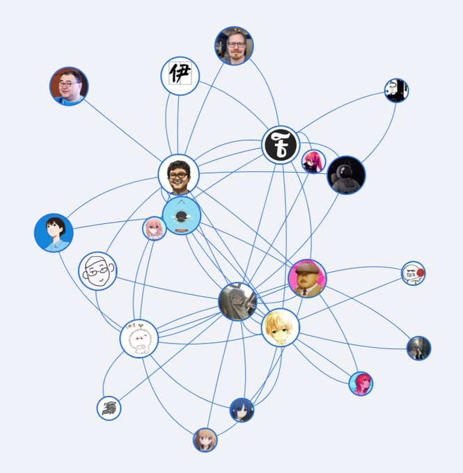

# About Me
I am an assistant professor at [Trent University](https://www.trentu.ca/) starting in Jan. 2024. Before that, I was a postdoctoral fellow at [McMaster University](https://dailynews.mcmaster.ca/) from May 2023 to Dec. 2023. I obtained my Ph.D. degree in Computer Science from [McMaster University](https://dailynews.mcmaster.ca/) in May 2023. I obtained my Master's degree in Applied Computer Science from [Winnipeg University](https://www.uwinnipeg.ca/) in May 2018. My research area is parallel computing, data structures, graph algorithms, and graph mining. 

I always work at the Peterborough campus. My Email is [binguo\[at\]trentu.ca](mailto:binguo@trentu.ca).

# Trent University 

Trent University is a public liberal arts university in Peterborough, Ontario, with a satellite campus in Oshawa, which serves the Regional Municipality of Durham. Trent is known for its Oxbridge college system and small class sizes. 

As a collegiate university, Trent is made up of five colleges. Each college has its own residence halls, dining rooms, and student government. The student government (Cabinet) and its committees cooperate with the College Office and dons in planning and delivering a variety of events for both its non-resident and resident members: visiting scholars, artists, musicians, and scientists; College dinners and dances; Fall and Winter College Weekend; and intramural co-educational competitions in a number of sports. Although Trent University is predominantly undergraduate, graduate programs are offered at the master's and doctoral levels.

The Symons campus of Trent, named after founding president Thomas Symons, is located on the banks of the Otonabee River at the northeast corner of the City of Peterborough. The Symons campus plan and its original college buildings, including Champlain College, Lady Eaton College, Bata Library, Chemistry Building, and the Faryon bridge which spans the Otonabee, were designed by Canadian architect Ron Thom.

Over 9 000 undergraduate students and over 800 graduate students are enrolled at the Peterborough campus while Trent University Durham GTA serves over 1 900 full- and part-time students at the campus on Thornton Road in Oshawa. The university is represented in Canadian Interuniversity Sport by the Trent Excalibur.
See [Wiki](https://en.wikipedia.org/wiki/Trent_University).  

## 1) Computer Science Master's Program
Currently, Trent University has a master's program in Computer Science under the [Applied Modelling and Quantitative Methods](https://www.trentu.ca/amod/). This is an interdisciplinary program which leads towards an M.Sc. or M.A. degree in the application of techniques and theory of modelling in the natural sciences and social sciences. It encompasses the following traditional disciplines: Biology, Business Administration, Chemistry, **Computer Science**, Economics, Geography, Humanities, Mathematics, Philosophy, Physics & Astronomy, and Psychology. The program is designed to overcome some of the barriers to interdisciplinary collaboration by bringing together, at the graduate level, students who are actively applying modelling techniques in their thesis research in a broad range of disciplines. The research is in the social and natural sciences, and in fields in which Trent has demonstrated strong research performance. Although it is oriented towards quantitative models, utilizing computational, mathematical or statistical techniques, it is discipline-based and is not a program in applied mathematics. 

Our Computer Science department recruits master's students under the **Applied Modelling and Quantitative Methods** program. If you apply this program if you would like to be a master's student in Computer Sciences. The detailed qualification for **Applied Modelling and Quantitative Methods** is [here](https://www.trentu.ca/graduatestudies/sites/trentu.ca.graduatestudies/files/documents/Programs%20at%20a%20Glance%20from%20TrentU_GradStudies_Viewbook2023_Digital%5B65%5D.pdf). 

---

# Research Projects
My research interest lies broadly in graphs. Graphs are important data structures that have many applications, such as social networks, weblink networks, and biological networks. Specifically, I study many kinds of graph algorithms in parallel and distributed computing. My Ph.D. studies focus on parallel algorithms of k-core decomposition and maintenance on shared memory multi-core machines. My recent research focuses on parallel or distributed algorithms in terms of graph queries and graph mining. The below two pictures show an example of social networks.  

<!--

-->

<table>
<tr>
<td>

</td>
<td>

</td>
</tr>
</table>

Here are several research projects that I am currently doing or plan to do:

## 1) Parallel Graph Algorithms
The traditional sequential graph algorithms need to be parallelized. The multi-core shared memory architectures are prevalent in recent years. We design parallel graph algorithms that can execute on multi-core CPUs, e.g. AMD Ryzen Threadripper 3990X with 64 cores, to achieve good speedups. For details, you can read my selected papers: 
* [Parallel Order-Based Core Maintenance in Dynamic Graphs](https://dl.acm.org/doi/abs/10.1145/3605573.3605597). This paper has been published at the top conference, the 52nd International Conference on Parallel Processing (ICPP 2023). It proposes a parallel algorithm of core maintenance, which is an important graph algorithm and has many applications. 
* [Efficient parallel graph trimming by arc-consistency](https://link.springer.com/article/10.1007/s11227-022-04457-9). This paper has been published in the Journal of Supercomputing.

## 2) Distributed and Federated Graph Algorithms 
The traditional distributed graph algorithms tend to use centralized servers for synchronization and never consider data privacy & security. We try to improve these distributed algorithms by using decentralized methods and protecting private information, so-called federated algorithms. Currently, I am working on the Federated Core Maintenance Problems. 

---

# Recruit Students
I am seeking highly motivated and dedicated Master's students starting from Winter 2024. Prospective candidates should have a background in __data structure and algorithms__ (especially on graphs), __parallel computing__, and C/C++ programming experience. __If you do not have such a background or your major is not computer science, it does not matter__; we still can talk and make a good research plan. During your master's studies, you will do experiments (mostly C++ programming) and finish a thesis. You will have the opportunity to work closely with me and collaborate with our team members.

Here is the [School of Graduate Studies](https://www.trentu.ca/graduatestudies/) and you can apply for [Applied Modelling and Quantitative Methods](https://www.trentu.ca/graduatestudies/sites/trentu.ca.graduatestudies/files/documents/Programs%20at%20a%20Glance%20from%20TrentU_GradStudies_Viewbook2023_Digital%5B65%5D.pdf), as our master program of Computer Science is under such program (see my front introduction to Trent University). If you are interested in **thesis-based**, you must find a supervisor to finish a research thesis and I am happy to be your supervisor; please send me an email including your CV, transcripts, and what kinds of research you would like to do. If you are interested in **course-based**, you must finish courses and do a project and you can directly apply. 

I am also recruiting PhD students. Since our department does not have PhD program, I can collaborate with the [Computing and Sofware Department at McMaster University](https://www.eng.mcmaster.ca/cas/programs/degree-options/phd-computer-science/) as a cosupervisor. That means you are McMaster's PhD students; you have a supervisor at McMaster and me as a cosupervisor. 

Our Computer Science department will provide many funding or scholarship opportunities to cover the tuition fee, like TA; also, I can provide part of the funding to support you. 
If you are interested, please send me your CV and a proposal to my [email](mailto:binguo@trentu.ca). I am happy to be your supervisor. 

Finally, if you like living in Canada, I encourage **international students** to apply for the master's program at Trent University. 
After graduating, you can apply for a [nomination for permanent residence in Ontario](https://www.ontario.ca/page/oinp-masters-graduate-stream), if you have a master's degree from an Ontario university.

---

# Teaching 

At Trent University: 
- COIS-3320H: Fundamentals of Operating Systems \[Winter 2024\]
- COIS-4370H: Computer and Information Security \[Winter 2024\]
  
At McMaster University:
- COMPSCI 1MD3: Introduction to Programming \[Spring 2023\] 
- COMPSCI 1DM3: Discrete Mathematics for Computer Science\[Winter 2022\]
- SFWRENG 3BB4: Concurrent System Design \[Fall 2021\]

---

# Selected Publication
My full publication list is on the [Google Scholar](https://scholar.google.com/citations?user=m3ONACQAAAAJ&hl=en). All papers have the arXiv version for reading. 
Here is my thesis and selected important publication. 

## Preprint

- Guo, Bin; Sekerinski, Emil; 	Simplified Algorithms for Order-Based Core Maintenance 2022
- Guo, Bin; Sekerinski, Emil; 	New Parallel Order Maintenance Data Structure	arXiv preprint arXiv:2208.07800				2022

## Thesis 
- MULTI-CORE PARALLEL GRAPH ALGORITHMS. Bin Guo. PhD Thesis. 2023. [Thesis pdf](https://macsphere.mcmaster.ca/bitstream/11375/28562/2/Guo_Bin_2023May_PhD.pdf), [Defense Slides ppt](publication/thesis/Defense-2.pptx), [Defense slides pdf](publication/thesis/Defense-2.pdf)

- On the Evaluation of Pattern Match Queries in Large Graph Databases. Bin Guo. Master Thesis. 2018 [Thesis pdf](https://winnspace.uwinnipeg.ca/bitstream/handle/10680/1997/Guo_Bin_final_thesis.pdf?sequence=1), [Defense Slides ppt](publication/thesis/defence-V1.5.pptx), [Defense slides pdf](publication/thesis/defence-V1.5.pdf)

## Journal
- Guo, Bin, and Emil Sekerinski. "Efficient parallel graph trimming by arc-consistency." The Journal of Supercomputing 78.13 (2022): 15269-15313. [springer](https://link.springer.com/article/10.1007/s11227-022-04457-9),[arXiv pdf](https://arxiv.org/pdf/2210.14290.pdf), [Presentation PPT](publication/icpp2023/icpp23-2.pptx), [Presentation PDF](publication/icpp2023/icpp23-2.pdf), [Poster PDF](publication/icpp2023/icpp23-poster.pdf)
  
- Chen, Yangjun; Guo, Bin; Huang, Xingyue; 	δ-Transitive closures and triangle consistency checking: a new way to evaluate graph pattern queries in large graph databases	The Journal of Supercomputing	76		8140-8174	2020	Springer US

## Conference
- Guo, Bin, and Emil Sekerinski. "Parallel order-based core maintenance in dynamic graphs." ICPP (2022). [arXiv pdf](https://arxiv.org/pdf/2210.14290.pdf), [Presentation ppt](publication/icpp2023/icpp23-2.pptx), [Presentation pdf](publication/icpp2023/icpp23-2.pdf), [Poster pdf](publication/icpp2023/icpp23-poster.pdf)

- Guo, Bin; Nagy, Jason; Sekerinski, Emil; 	Universal Design of Interactive Mathematical Notebooks on Programming	Proceedings of the 53rd ACM Technical Symposium on Computer Science Education V. 2			1132-1132	2022

